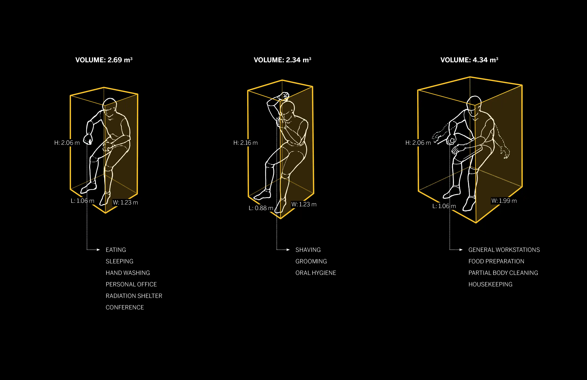
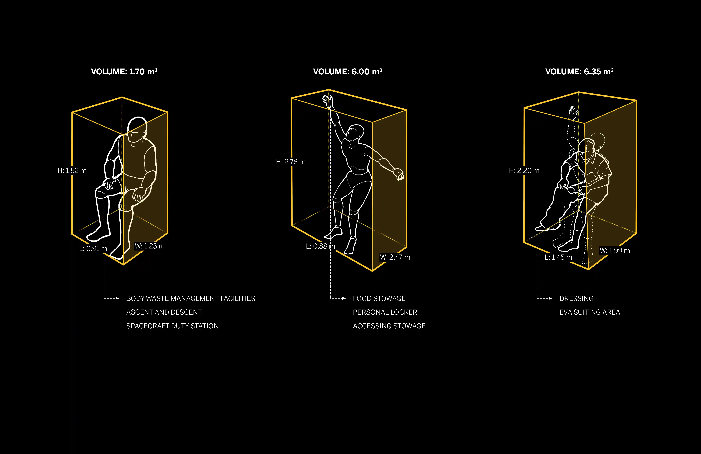
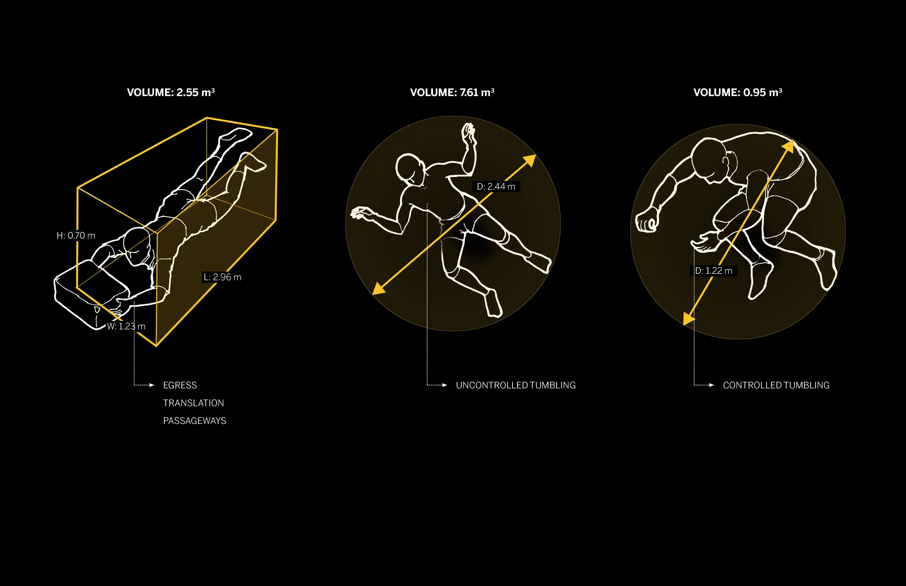
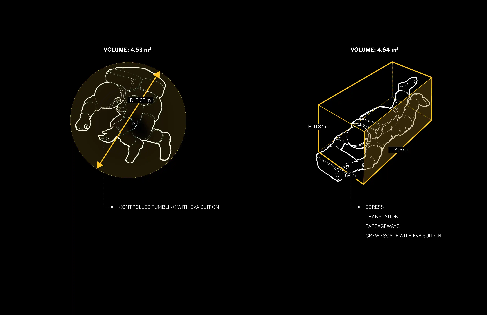

_I was honored to be selected as a part of the Moon Village research team while I worked for SOM. My role is to help the team to generate design concepts focusing on human-scale measurement and convey these key ideas through illustration._

**UPDATE 01/02/2022:** Review original post and make some narrating and formatting changes.

## Moon village research

**Research 1**

**Research 2**

**Research 3**

**Research 4**
