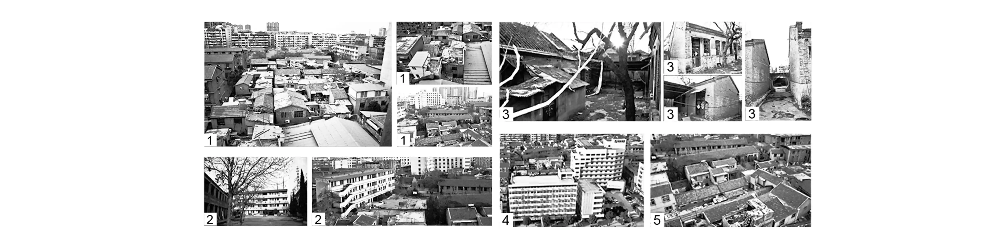
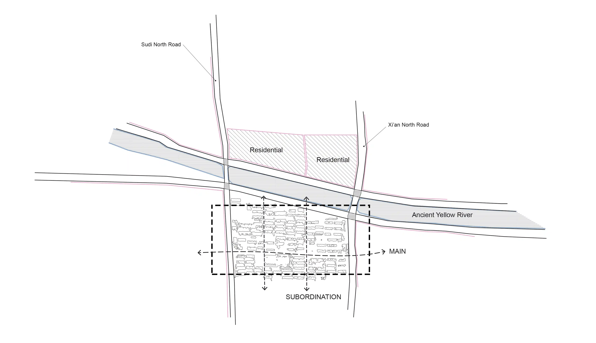
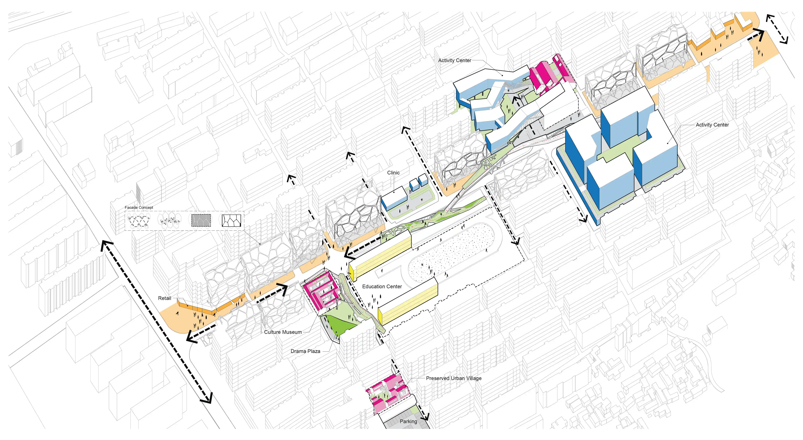
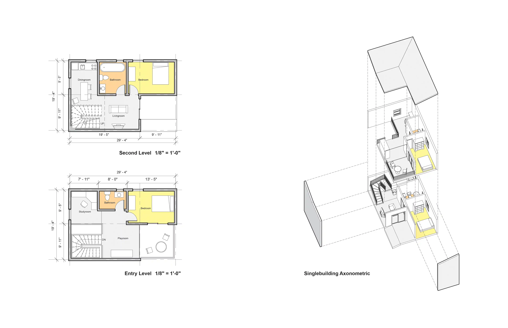
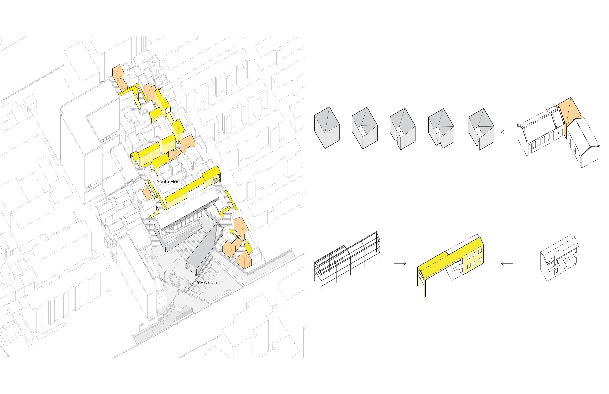
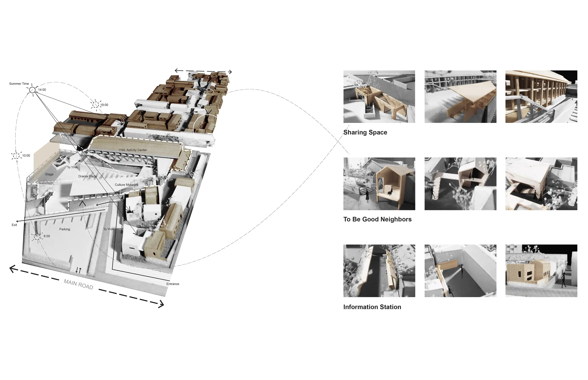

_An innovative, urban-scale interpretive at a defunct Urban Village, also known as "Village in City" in developing countries. Investigate breathing new life into a pressing social issue. Portray a fresh, down-to-earth community life among high-density residential buildings._

**UPDATE 01/02/2022:** Review original post and make some narrating and formatting changes.

## Site

### 1. Photo

**Site photos**

**Site birdview**

### 2. Diagram

**Site diagram**

### 3. Concept

**Site concept**

## Design

### 1. Unit

**Design unit**

### 2. Site

**Design site**

### 3. Model

**Design model**
