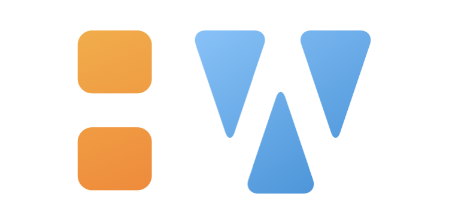
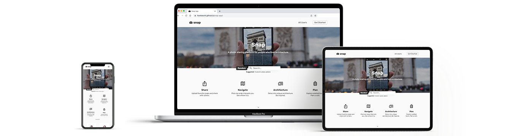
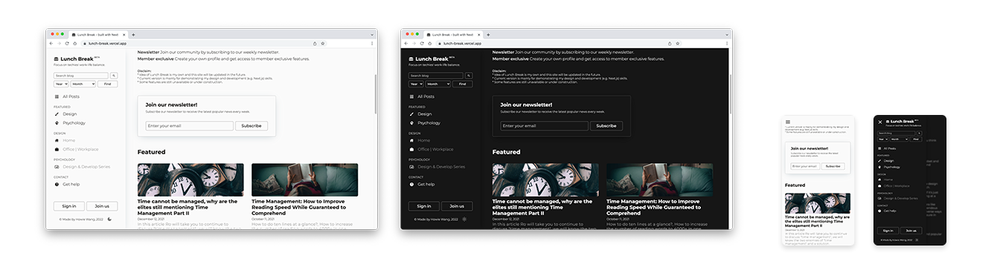
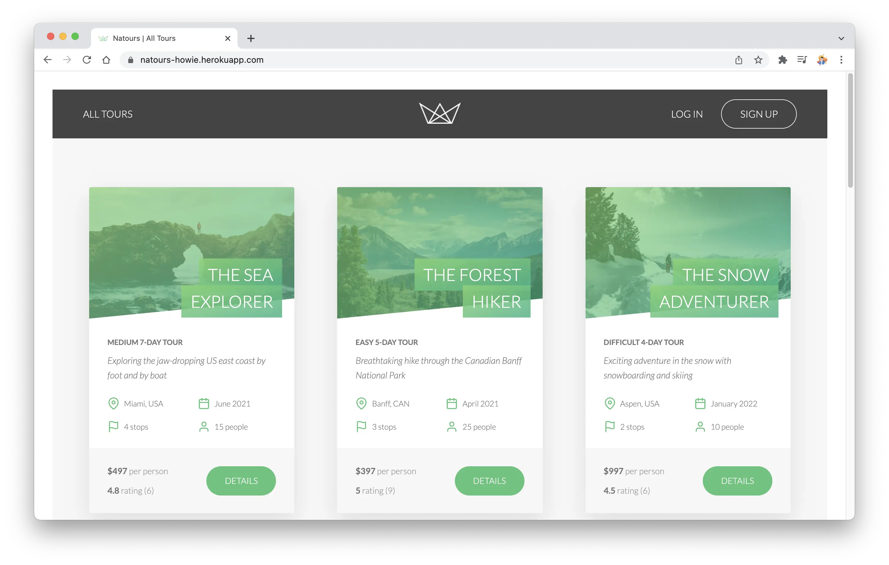
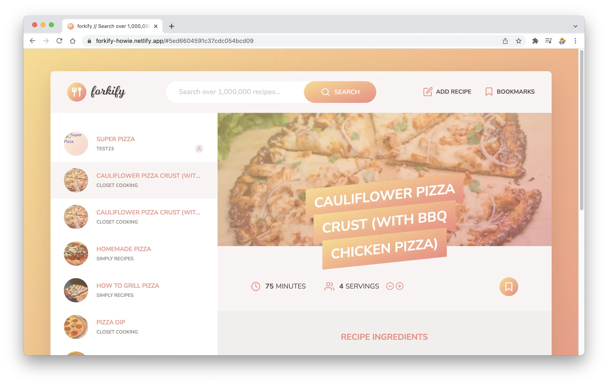

<!-- NOTE HEAD SECTION -->

  
  

    <a href="https://www.howiework.com/" target='_blank'>View Site</a> • 
    <a href="https://github.com/HowieWork/howiework/" target='_blank'>GitHub</a>
  

 

<!-- NOTE INTRO SECTION -->

## Welcome!

Hi, my name is Howie. I'm a web designer/developer based in the US with a background in architecture.

I am always willing to embrace new technology. At school, I took programming courses like [Data Visualization](https://www.howiework.com/documents/data_visualization.html) and [Grasshopper](https://www.howiework.com/posts/inclusive-center). My professional experience started at WeWork. I was fascinated by how a data-driven approach is implemented in design. It’s also fun to work with tech-background colleagues. Later at SOM, I worked on [an interior project involving VR](https://www.howiework.com/posts/anti-office). The team added a VR interaction session to the final presentation for the client. It was a big success. These two experiences really open my mind and reveal more opportunity and potential in the tech industry. In my spare time, I [self-taught programming](https://www.howiework.com/posts/thoughts-about-self-teaching-web-development) and gradually realize my true passion for web development.

[My diverse background prepares me with both design and development skills](https://www.howiework.com/posts/what-ive-learned-about-architecture-and-web-development): a keen eye for design; professional experience using a wide range of digital design tools; design thinking, proven problem solving, research and analytical skills.

In my spare time, I am working on [Repeat App](https://twitter.com/howiework/status/1496848333289271300) - a full-stack project aims to improve language skills and building his own [React Guide](https://howiework.github.io/react-guide/) while solidifying [Data structure and Algorithm](https://github.com/HowieWork/data-structure-and-algorithms). Post videos about [how I solve React problems live](https://t.co/zp4piEZITt) occasionally.

**Watch a video**:
I also made [a self-introduction video](https://youtu.be/HY-1dhShcHk).

**Sidenote**:
It is worth to note I completely redesign and rebuild my portfolio website using React. It is a major update from [previous design version](https://github.com/HowieWork/howiework-v1-archived) preparing for my aspiring dev career. [View source code](https://github.com/HowieWork/howiework/tree/main).

**Current status 05/31/2022**: Shopify Liquid.

 

  
  
  
   

 

### Built with

[![React][react-shield]][react-url] [![react-dom][react-dom-shield]][react-dom-url] [![react-markdown][react-markdown-shield]][react-markdown-url]

 

<!-- NOTE SELECTED PROJECTS SECTION -->

## Selected Projects

I picked two projects as an indication of my full-stack develop skills. Also, apply newly learned knowledge to something I feel excited about always motivates me to keep going.

 

  <h3>Snap App</h3>
  

    <a href="https://howiework.github.io/snap-app/" target='_blank'>View Site</a> • 
    <a href="https://github.com/HowieWork/snap-app" target='_blank'>GitHub</a>
  

 

  

 
 

[![React][react-shield]][react-url] [![Node][node-shield]][node-url] [![Express][express-shield]][express-url] [![Axios][axios-shield]][axios-url] [![Mongoose][mongoose-shield]][mongoose-url]

Snap App focus on creating a photo sharing platform for people who love architecture. It integrates sharing, navigation, architecture information and tour planning together. [Watch a video](https://youtu.be/9CF7wCwRC5c) for details.

 
 
 

  <h3>Lunch Break</h3>
  

    <a href="https://lunch-break.vercel.app/" target='_blank'>View Site</a> • 
    <a href="https://github.com/HowieWork/lunch-break/" target='_blank'>GitHub</a>
  

 

  

 
 

[![Next][next-shield]][next-url] [![React][react-shield]][react-url] [![Mongodb][mongodb-shield]][mongodb-url]

A blog site focus on work-life balance. Its content is around three topics: design, psychology and community. Built with Next.js. [Watch a video](https://youtu.be/jIDyerwpAXw) for details.

 

<!-- ----------------------------------------- -->

## Portfolio Changelog

  <ul>
    <li>
      
<strong>Feb 06, 2021</strong> HowieWork (designer edition) goes live! *Site has been archived at

      
*Site has been archived at <a href="https://github.com/HowieWork/howiework-v1-archived" target="_blank">GitHub</a>

    </li>
    <li>
      
<strong>Dec, 2021 - Feb, 2022</strong> Completely re-design and re-develop HowieWork (developer edition).

      

        
View detail

        <ul>
          <li><strong>Dec 11, 2021</strong> Complete design ideaion including wireframing, design system and prototyping</li>
          <li><strong>Dec 18, 2021</strong> Build basic React structure based on Routes and Pages and React components</li>
          <li><strong>Dec 26, 2021</strong> Support for dark mode</li>
          <li><strong>Dec 30, 2021</strong> Add post section</li>
          <li><strong>Jan 04, 2022</strong> Update website content</li>
          <li><strong>Feb 02, 2022</strong> HowieWork v1.0 goes live!</li>
          <li><strong>Mar 22, 2022</strong> Major updates: Add Portfolio presentation video, Data visualization & Grasshopper; Add Send Message feature for better UX</li>
        </ul>
      

    </li>
  </ul>

<a href="#top">Back to Top ↑</a>

<!-- ----------------------------------------- -->

## Certifications & some tutorial projects

I started to use GitHub very early during my self-teaching. In the beginning, I mainly use GH as a platform to keep a track of what I've learned. Also, I can always go back to GH for reviewing knowledge. With the help of GH pages, I was able to publish some of the projects I followed along tutorials. Here are two examples - [Natour](https://github.com/HowieWork/natours) & [Forkify](https://github.com/HowieWork/forkify):

  
    
  
  
    
  

 

A list of certifications I earned:

  <ul>
    <li>  
      

        <strong>Jan 23, 2022</strong>
        <a href="assets/readme/cert-nextjs-howie.webp">Next.js & React - The Complete Guide</a> 
        

          *Also, I wrote a post about
          <a href="https://www.howiework.com/posts/how-i-learn-nextjs" target="_blank"><em>How I learn Next.js</em></a>
        

      

    </li>
    <li>  
      

        <strong>Dec 30, 2021</strong>
        <a href="assets/readme/cert-react-howie.webp">React - The Complete Guide (incl Hooks, React Router, Redux)</a> 
      

    </li>
    <li>  
      

        <strong>Sep 20, 2021</strong>
        <a href="assets/readme/cert-node-howie.webp">Node.js, Express, MongoDB & More: The Complete Bootcamp 2021</a> 
      

    </li>
    <li>  
      

        <strong>Sep 8, 2021</strong>
        <a href="assets/readme/cert-html-css-howie.webp">Build Responsive Real-World Websites with HTML and CSS</a> 
      

    </li>
    <li>  
      

        <strong>July 15, 2021</strong>
        <a href="assets/readme/cert-js-howie.webp">The Complete JavaScript Course 2021: From Zero to Expert!</a> 
      

    </li>
    <li>  
      

        <strong>April 9, 2021</strong>
        <a href="assets/readme/cert-web-bootcamp-howie.webp">The Complete 2021 Web Development Bootcamp</a> 
      

    </li>
    <li>  
      

        <strong>October 10, 2020</strong>
        <a href="assets/readme/cert-FCC-ds-algorithm-howie.webp">JavaScript Algorithm and Data Structure</a> 
      

    </li>
    <li>  
      

        <strong>September 8, 2020</strong>
        <a href="assets/readme/cert-FCC-responsive-web-howie.webp">Responsive Web Design</a> 
      

    </li>
  </ul>

<a href="#top">Back to Top ↑</a>

<!-- ----------------------------------------- -->

<!-- FOOTER SECTION -->

 
 
 

© 2022 Made by Howie

 
<!-- NOTE REFERENCE STYLE FOR READABILITY -->

![Last Commit][last-commit-shield] [![MIT License][license-shield]][license-url] [![Twitter][twitter-shield]][twitter-url]

<!-- ----------------------------------------- -->

<!-- BADGES/SHIELDS REFERENCE -->
<!-- Site Related -->

<!-- Built with -->

[react-shield]: https://img.shields.io/static/v1?label=React&message=v17.0.2&color=blue&style=flat-square
[react-url]: https://reactjs.org/
[react-dom-shield]: https://img.shields.io/static/v1?label=react-dom&message=v17.0.2&color=blue&style=flat-square
[react-dom-url]: https://reactjs.org/docs/react-dom.html
[react-markdown-shield]: https://img.shields.io/static/v1?label=react-markdown&message=v7.1.1&color=lightgrey&style=flat-square
[react-markdown-url]: https://remarkjs.github.io/react-markdown/
[node-shield]: https://img.shields.io/static/v1?label=Node&message=v14.17.4&color=green&style=flat-square
[node-url]: https://nodejs.org/
[express-shield]: https://img.shields.io/static/v1?label=Express&message=v4.17.1&color=lightgrey&style=flat-square
[express-url]: https://expressjs.com/
[axios-shield]: https://img.shields.io/static/v1?label=Axios&message=v0.24.0&color=purple&style=flat-square
[axios-url]: https://axios-http.com/
[mongoose-shield]: https://img.shields.io/static/v1?label=Mongoose&message=v6.0.14&color=brightgreen&style=flat-square
[mongoose-url]: https://mongoosejs.com/
[next-shield]: https://img.shields.io/static/v1?label=Next&message=v10.0.6&color=lightgrey&style=flat-square
[next-url]: https://nextjs.org/
[mongodb-shield]: https://img.shields.io/static/v1?label=MongoDB&message=v4.3.0&color=brightgreen&style=flat-square
[mongodb-url]: https://www.mongodb.com/

<!-- General -->

[last-commit-shield]: https://img.shields.io/github/last-commit/howiework/howiework?style=flat-square
[license-shield]: https://img.shields.io/github/license/howiework/howiework?style=flat-square
[license-url]: https://github.com/HowieWork/howiework/blob/gh-pages/LICENSE
[twitter-shield]: https://img.shields.io/twitter/follow/howiework?label=Follow%20%40howiework&logo=Twitter&style=flat-square
[twitter-url]: https://twitter.com/howiework
