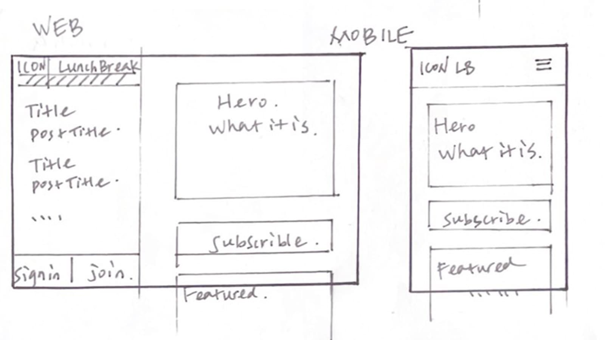
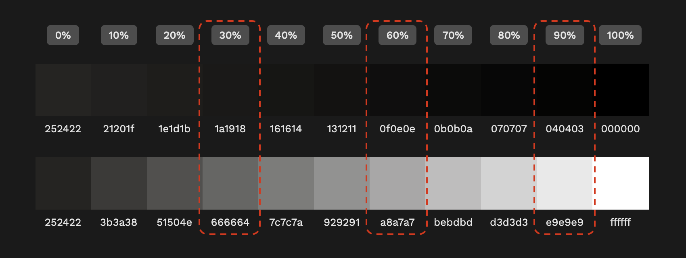

_I have been rethinking a better way of building blog site. Lunch Break is a more advanced blog site built with Next.js. It will include features like authentication (user sign up and log in), newsletter subscription feature, show all/featured posts, filter posts, comments etc._

**UPDATE 01/24/2022:** Update content after completion of blog site development.

## Background

Two short stories inspire me of creating a more advanced blog site called LunchBreak.

Initially, LunchBreak is a personal WeChat Official Account (aka. OA) I created and have been managing since the end of 2018. While still working as a full-time architectural designer, I came up with the idea of creating a blog site during my lunch breaks. It aims to help people to grow a positive mindset and live a better life by sharing design and psychology knowledge. I also posted [full story of LunchBreak](FIXMEFULLSTORYOFLUNCHBREAK.COM).

Near the end of 2021, I added a blog feature to [my newly updated portfolio site - howiework](FIXMEHOWIBUILTMYPORTFOLIOSITE.COM). That was the time when I am not familiar with Next.js and haven't built anything personal using this framework. Heard a lot of awesome features like file-based routing system, built-in server-side rendering.

After all, I decide to bring my own design to the web and code my own platform using Next.js. This project starts with prepared content. The main challenge is to how to create the 'shell'. Meanwhile, I am taking [a complete Next.js course](FIXMEHOWILEARNNEXTJS.COM) and having a goal of building something personal while taking online courses could be very beneficial.

### Ideation

A blog site focusing on work-life balance. Its content is around three topics: design, psychology and community.

Main features:

- Basic: show all/featured/single post
  - search & filter feature
  - comments section
  - \*share feature
  - dark mode
- Contact: get general support
- Newsletter registration
- User authentication: sign up/login; page access control; access exclusive features.

## Design

With blog content already in mind, I follow one design rule - Simplicity. Main features, like search, filter, authentication, can easily be spotted. User could easily navigate through different sections. This project should be content-driven. Existence of visual part serves for better presenting content. There should not be any redundant design, which could bring potential distraction for users.

### Layout

Some quick sketches of basic layout idea for both web and mobile devices.


**Layout sketches: web & mobile**

### Design system

Black, white, grey as color scheme:


**Design system - color**

```css
:root {
  /* COLORS */
  --primary-color: #252422;
  --primary-color-tint--30: #666664;
  --primary-color-tint--60: #a8a7a7;
  --primary-color-tint--90: #e9e9e9;
  --primary-color-shade--30: #1a1918;
  --primary-color-shade--60: #0f0e0e;
  --primary-color-shade--90: #040403;

  --background-color: #fafafa;

  --pending-color: #2c4a73;
  --success-color: #7bb87b;
  --error-color: #ff7675;
}

/* DARK MODE */
.dark-theme {
  --background-color: #161616;
  --primary-color: #fff;
}
```

Montserrat as font family:

```css
/* GOOGLE FONTS: MONTSERRAT */
@import url('https://fonts.googleapis.com/css2?family=Montserrat:wght@100;300;400;500;700;900&display=swap');

body {
  font-family: 'Montserrat', sans-serif;
}
```

## Development

### Guidelines

1. Front-end:  
   (1) Layout & Routes: main navigation is shared by all routes. Based on SoC, main navigation could be separated from the rest. Design routes ahead due to file-based routing system;
   (2) Main navigation: position could be fixed, out of the flow;
   (3) Pages/Components for corresponding routes.

2. Back-end:
   (1) API routes;
   (2) MongoDB: contacts, signed up user, subscribed user, post comments.
3. Technology: below is a list of key technologies
   (1) Next.js for both FE and BE;
   (2) Markdown: Blog posts will be written in markdown;
   (3) MongoDB: store users contact information in MongoDB database.

### Roadmap

Roadmap contains steps I implement in great detail. Overall, it follows the guidelines I state above.

1. Set up main pages: homepage; contact page; all posts page; post detail page
2. General layout: Build main navigation and logo components; add basic styling.
3. Homepage: Build homepage components and homepage layout; add styling.
   (1) Hero section;
   (2) Subscription section.
4. Post layout and components: Build general posts layout component and post item component.
   (1) post layout (grid / list) component \*grid layout for homepage; list layout for the rest;
   (2) post detail component.
5. Post related pages
   (1) Featured posts section at homepage;
   (2) All posts page;
   (3) Post detail page.
6. Working with Markdown
   (1) where to store Markdown files;
   (2) Render markdown file.
7. Contact page \*for users to send message
   (1) Build contact page;
   (2) Add API route: /api/contact.
8. Set Head meta data for all pages \*SEO
9. Prepare for handling incoming user data: setup MongoDB
10. Feature: Newsletter Registration
    (1) API route `api/subscribe`: POST;
    (2) `components/input/` Build Components: SubscriptionForm;
    (3) Store data to MongoDB: connect to DB, then insert to collections (subscription/emails).
11. Feature: Comments
    (1) API route `api/comments/[postId]`: POST & GET;
    (2) `components/input/` Build Components: NewCommentForm, Comments, CommentList, CommentItem;
    (3) Store data to MongoDB: connect to DB, then insert to collections (posts/comments).
12. Feature: Authentication: Site content requiring authentication: write comment option; all series posts.
    (1) Build `/auth` page and `AuthenticationForm` component for Log in & Sign up;
    (2) Build `/profile` page and `UserProfile` and `ProfileForm` components;
    (3) API route `api/auth/signup`;
    (4) API route `api/auth/[...nextauth].js`;
    (5) Protecting Pages;
    (6) Protecting API routes.
13. Add Global notification for better UX: notification context
    (1) Notification context;
    (2) Portal fix `document is undefined` error \* [`/HOC/Portal.js`](https://dev.to/ataparvinghods/react-portals-and-how-to-use-them-next-js-and-cra-2dic);
    (3) Implement context for all forms.
14. Feature: Search & filter
15. Styling update \*focus on responsiveness
16. Update website contents including website description and posts contents

## Deployment

Considering this app contains both FE and BE, workflow would be:

1. develop locally;
2. `next build` when ready for production;
3. publish project directory to GitHub;
4. `next start`.

I chose Vercel, for production deployment and optimization, and GitHub, for storing repository remotely.

Links: LunchBreak [Demo](FIXMEDEMOLINK.COM) | [GitHub](FIXMEGITHUBLINK.COM)

## Conclusion

Project oriented learning had so many benefits. It drives me throughout the learning process. It becomes easier to grasp what goals I need to achieve and what knowledge can be implemented in my own project before each section. After each section, instead of some example projects, working on real projects prepares you better for future jobs. Also, as learning progress, the vision of final project is getting more and more clear. The feeling of being more and more confident is great!

Most importantly, I got a real project done and finally revived a formal design project. Lessons I learned will keep benefiting me in future projects. Also, this project is still in beta version. There are still some features, e.g. sharing, and optimization need to be done. I will find time updating the project in the near future.

### Some useful links

1. [How I learn Next.js](FIXMEHOWILEARNNEXTJS.COM)
2. [How my website was built](FIXMEHOWIBUILTMYPORTFOLIOSITE.COM)

### A side note: How this project correlates with [Next.js complete course](COURSE_LINK).

I didn't follow the original course syllabus but re-arrange to fit my own needs for final project. Each list item contains the section title and how it relates to certain features of my project.

- Section 11: complete APP example
  - All posts page
  - Individual post page
  - Contact page \*submit help ticket
- Section 4: file-based routing
  - Search & Filter feature
- Section 9: Project time: API routes
  - Newsletter registration flow \*subscription section for homepage
  - Comments feature
- Section 10: app-wide state
  - work with react context for notification - a better UX
- Section 13: authentication
  - Authentication feature \*sign up, log in, exclusive features
  - Add page control access: FE/BE
- Section 12: deployment
  - Choose deployment option
  - Configuring and preparing the project
  - Deploying
