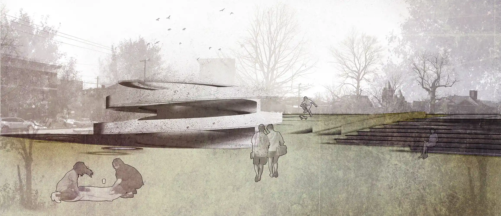

_This article will provide a template for most future posts on this site. The goal is to make most posts look styling consistent. As a template, this section usually works an introduction, which explain what this post is about and how audience can get most out of it._

**UPDATE 12/29/2021:** Initial post commit. Update will give audience the latest update of this post. What has been changed or what links has been added. For example, [an empty helpful link](https://www.example.com).

## Site

### 1. Site photos

**Above ground**

### 2. Mapping

### 3. Analysis

### 4. Accessibility

## Design

### 1. Program

### 2. Plan

### 3. Section

## Structure

### 1. Diagram

### 2. Model

## Render

### 1. Scenes

### 2. Whole site
