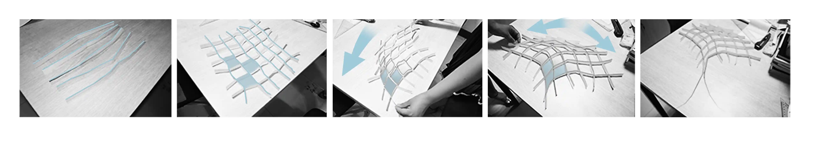
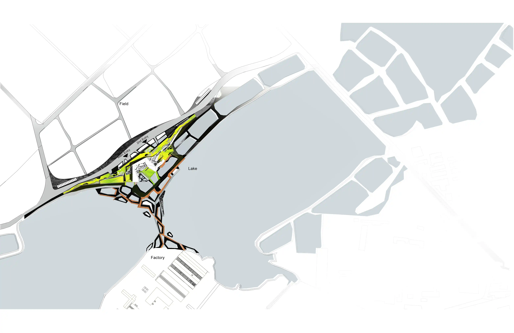
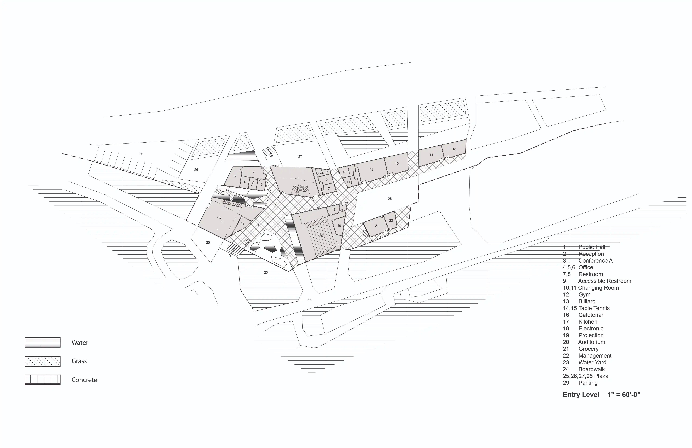
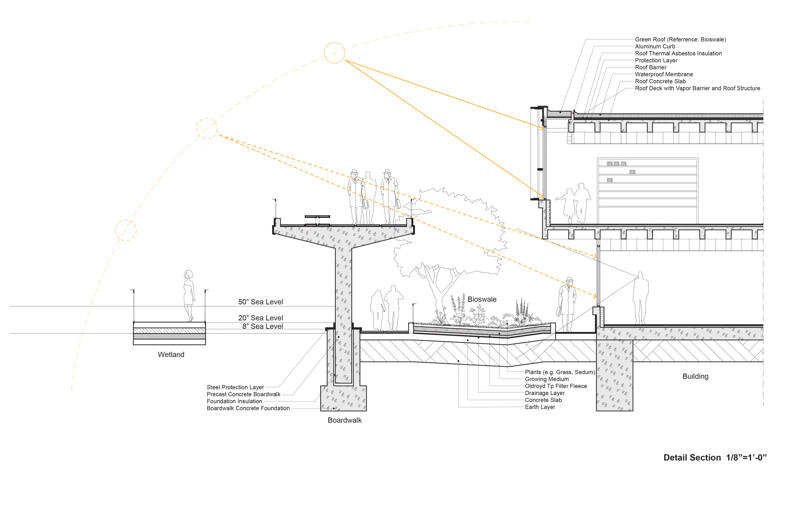
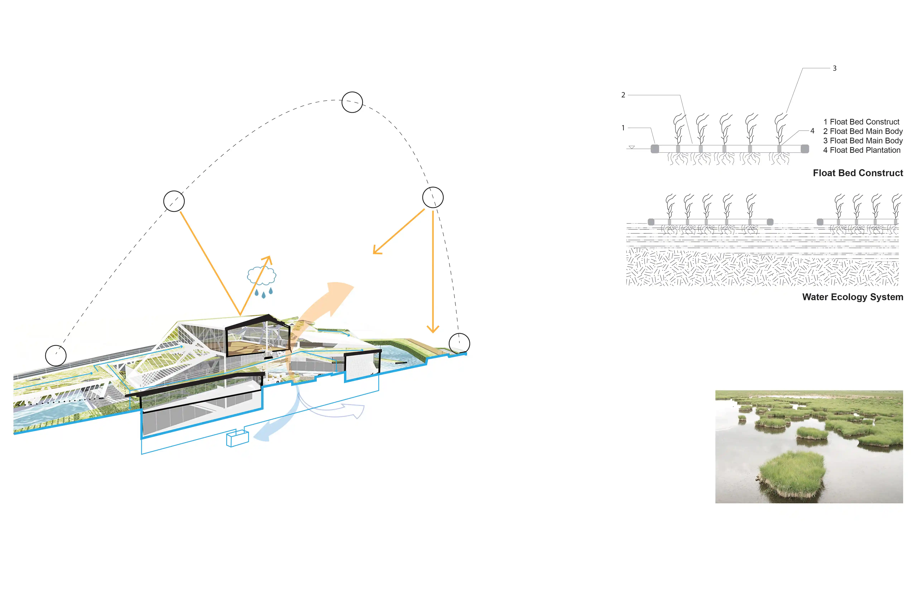
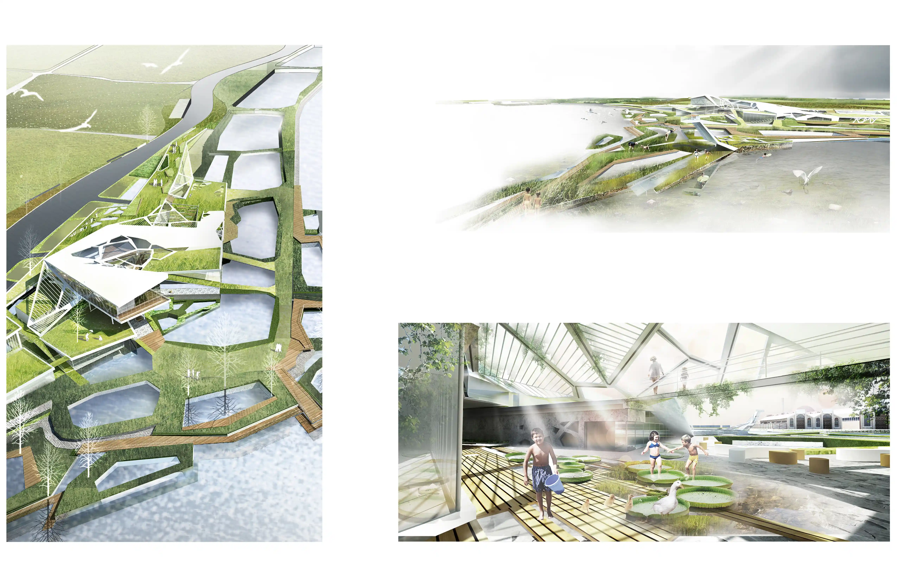

_A new park mediates two distinct typologies - a field and a lake, inspired by the environment. This project creates not only a new relationship between architecture and landscape but also a dialogue between human and nature._

**UPDATE 01/02/2022:** Review original post and make some narrating and formatting changes.

## Site

As one of the social and environmental issues, Coastal Resilience is brought to architects attention. The project not only mediates between two distinct typologies close to the site – a field and a lake, but also creates a dialogue to the factory across from the site. The project demonstrates both the relationships between typology and water and the connection between architectural form and structure.

### 1. Diagram

**Site diagram**

### 2. Plan

**Site plan**

## Design

### 1. Plan

**Design plan**

### 2. Section

**Design section detail**

**Design section diagram**

## Render

**Render**

Note: First Prize of the 1st Jiangsu Province Architect Cup Architecture Design Scheme Competition
