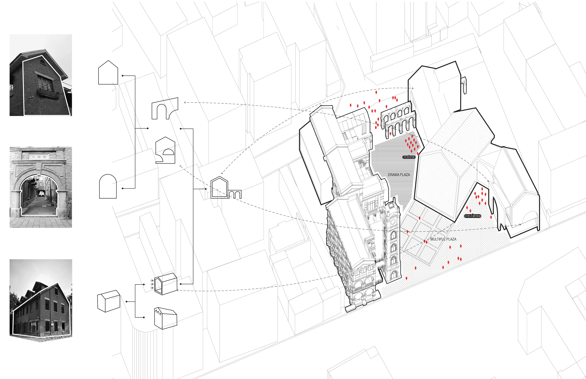
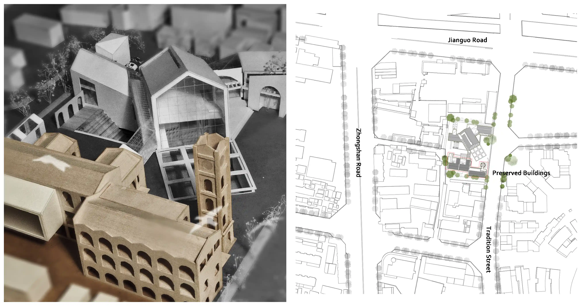
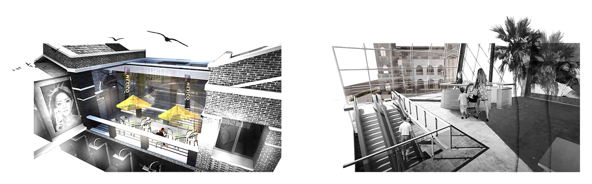
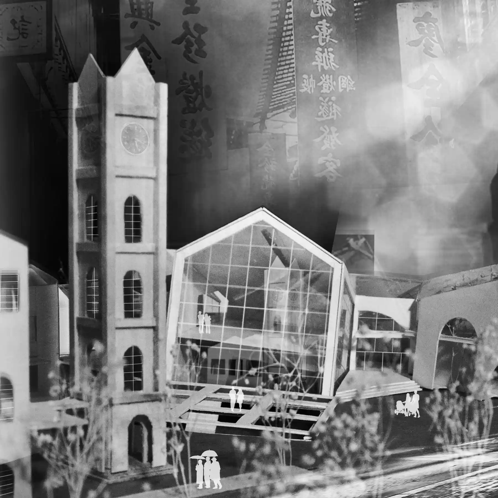

_An expansion of a historical building built during the Republic of China. A project brings a balance between historical heritage and contemporary architectural technics._

**UPDATE 01/02/2022:** Review original post and make some narrating and formatting changes.

## Concept

Faced with the few remaining historical buildings, which are going to be demolished, do architects still have the strength to honor tradition, the classical? Probably, the replication of classical only reflects stubbornness and ignorance in imitating ancient styles.

Reversely, an innovation that completely abandons classical is also only an irresponsible action. Designer Hao makes efforts to find a new way for this problem.

Historical Resilience can be understood as Relative Innovation coming from classical. Architect gets inspiration from classical firstly and then develops into symbolic language. The goal is to realize: the strength to come back. To fulfill people with extraordinary classical architecture memory and experience.

**Design concept**

## Site plan

**Site plan**

## Render

**Render**

## Model

**Model 1**

**Model 2**

Note: Received “Excellent Award” of 2013 Autodesk Revit Cup National Sustainable Architecture Design Competition for College Students
