_LunchBreak is a blog, aims to help people to grow a positive mindset and live a better life by sharing design/psychology knowledge._

**UPDATE 01/25/2022:** Update original post content.

## Background

LunchBreak is a personal WeChat Official Account (OA) I created and have been managing since the end of 2018. I came up with this idea through countless lunch-breaks:

I was working as a full-time architectural designer for a large international corporation at Washington DC. [An interior office project](www.howiework.com/posts/anti-office) for a large tech company I was working on was still at the earlier stage. My role was to conduct researches relating to how the working environment affects employees' performance and how it informs office design. Meanwhile, I had the chance to talk to office workers and got a better understanding of how design affects people's daily life.

Gradually, I realized that bring aesthetics into people's life is only a part of designers' responsibilities; convey design ideas and educate are issues needs designers' attention. I decided to start a blog on a digital platform (WeChat OA), which I am a daily user of and more familiar with.

In retrospect, the whole working progress reflects ideas in product design. It involves ideas of the **user journey**, **wire flow**, **prototyping**, **user testing**, and **measurement**. I thought it is worthwhile to write down the working progress and learn from it.

## Context

Preparing LunchBreak consists of two parts - content and form.

### Content

The first thing is to figure out what the blog is about and why I am doing it. I wrote an article about it.

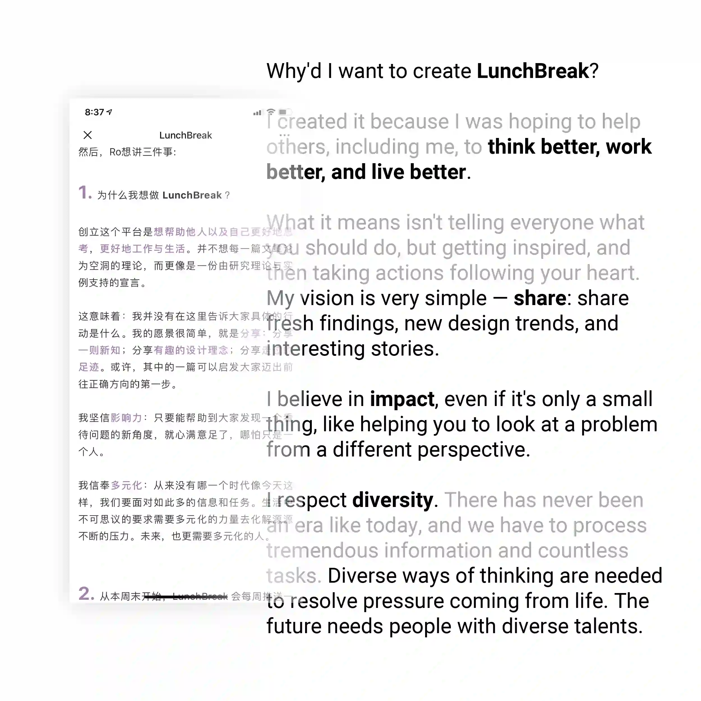
**Vision**

**Google Drive** was the main tool helping me to manage LunchBreak contents.
I used **Google Docs** for collecting ideas and writing and **Google Sheets** for organizing contents have been/ready to be published.

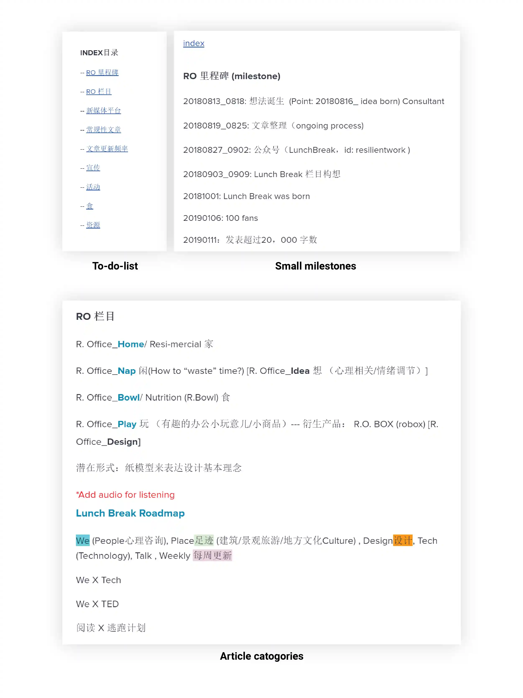

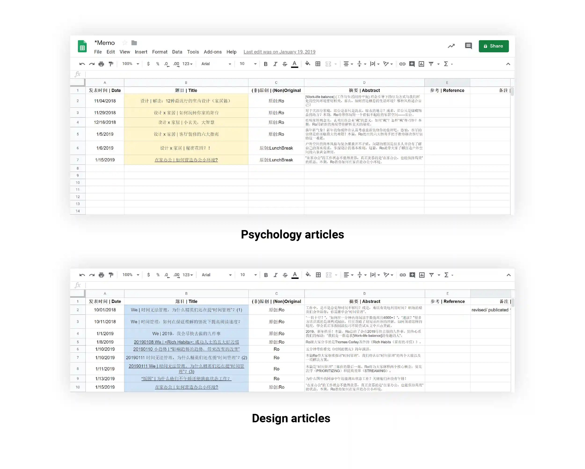

Then I started to structure User journey (what will the reading experience be like)

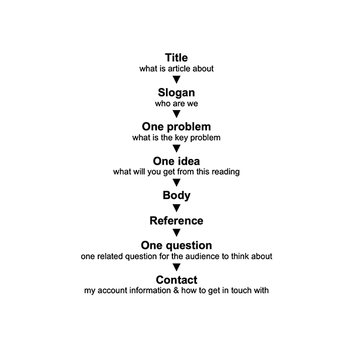
**User journey**

### "Design system"

I didn't know there is a term called Design System at that time. But what I did was exactly developing a Design System for my blog. I thought I it would be fun to share the original pieces:

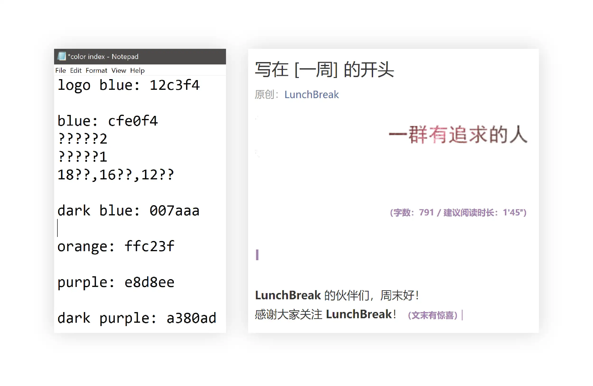
**Color palette & typography**

I also designed logo, QR code, banners:

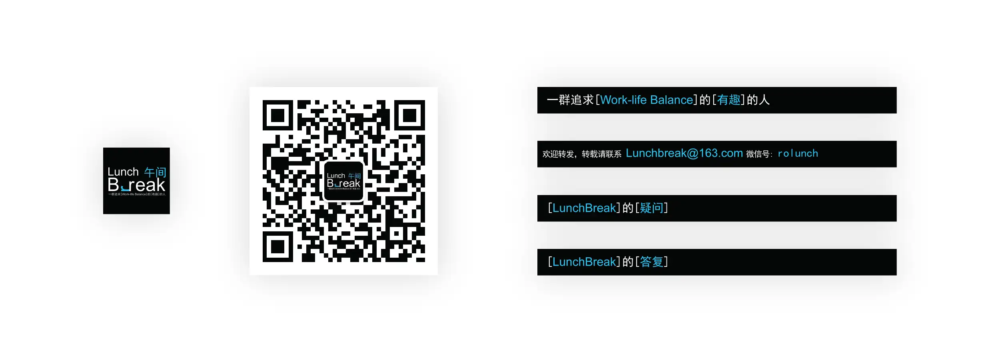
**Branding - square ver.**

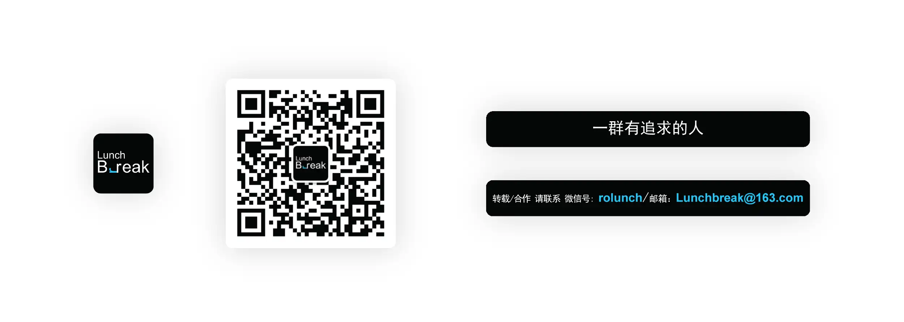
**Branding - round ver.**

Because it is about sharing knowledge. So my understanding is not to let Form (aesthetic) "steal Content's thunder".
I started to think about how Form could better serve for Content without getting people distracted.

After learned product design, wireframing was great to present the idea on my mind when I was doing this project; So I did it specially for this post.

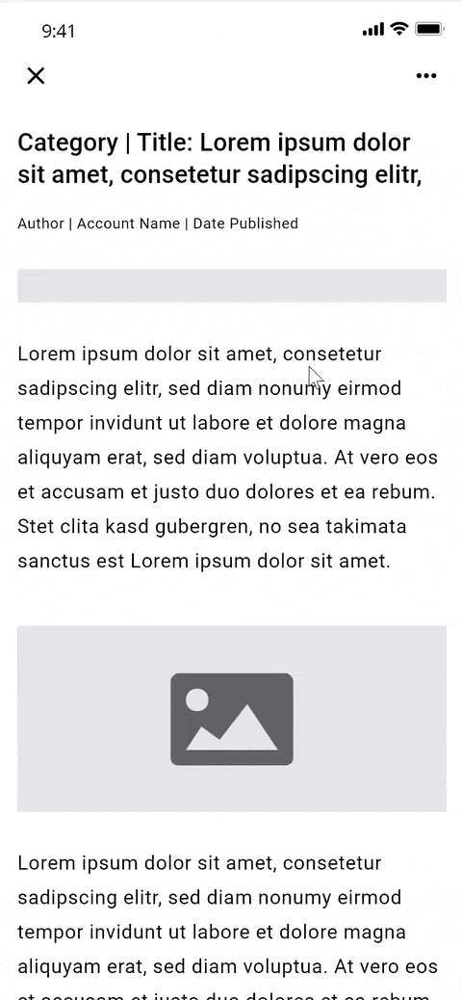
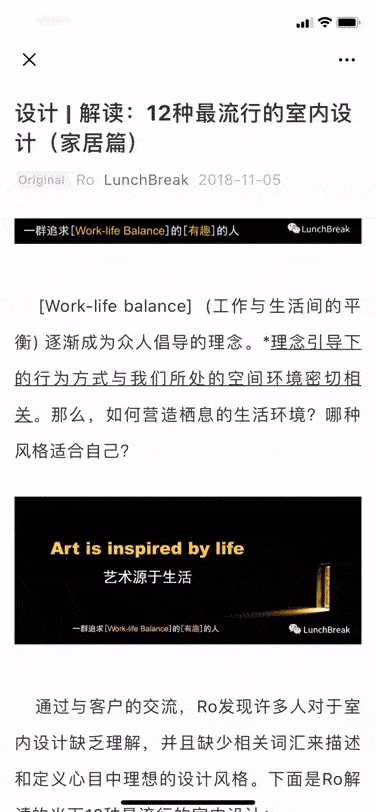
**Wireframe & prototype example**

## Getting feedback and some updates

After it launched:

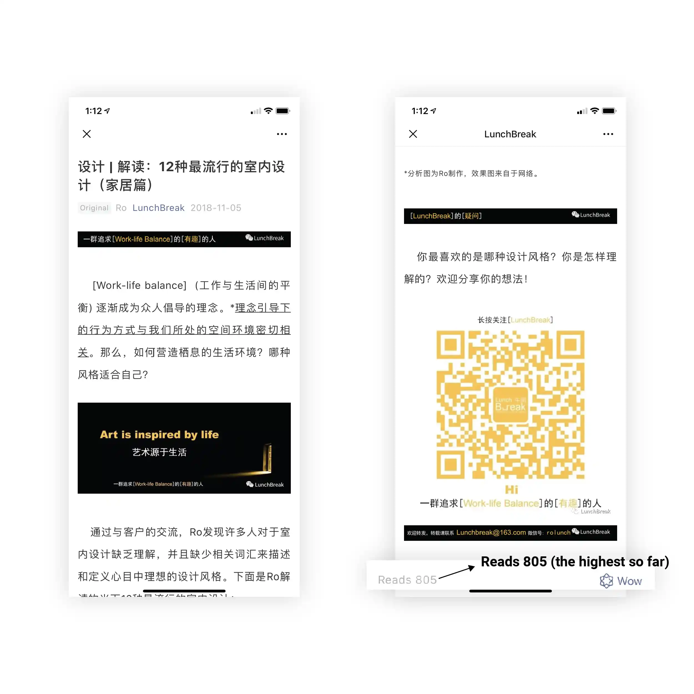
**First article performance**

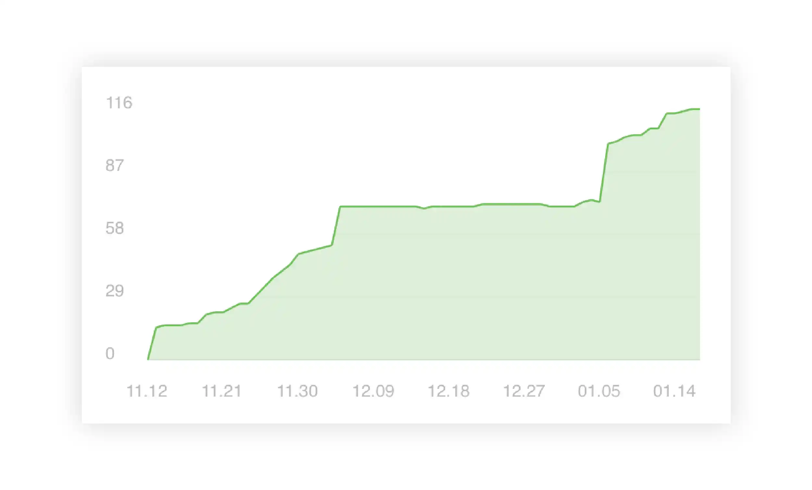
**Followers growth chart**

Start to get feedback:

- Time not sure of how much time each article will take.
- Since it is about work-life balance It might be fun and help people to relax by adding a little bit of sound. Music might be a good choice.

Also, as contents start to grow, add links, in the end, helps readers to find more related articles.

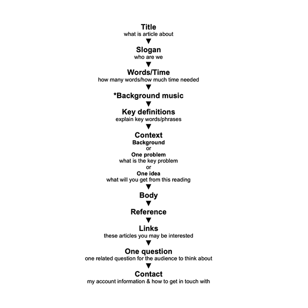
**Updated user journey**

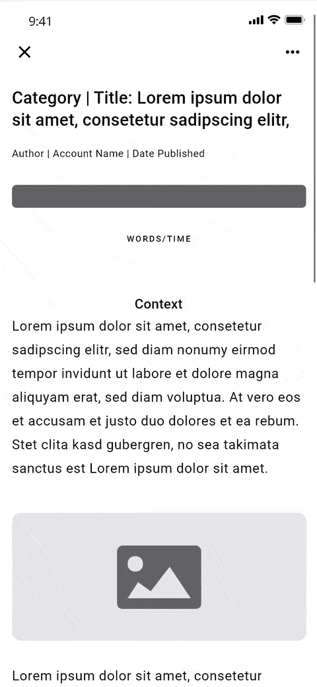

**Updated wireframe & prototype example**

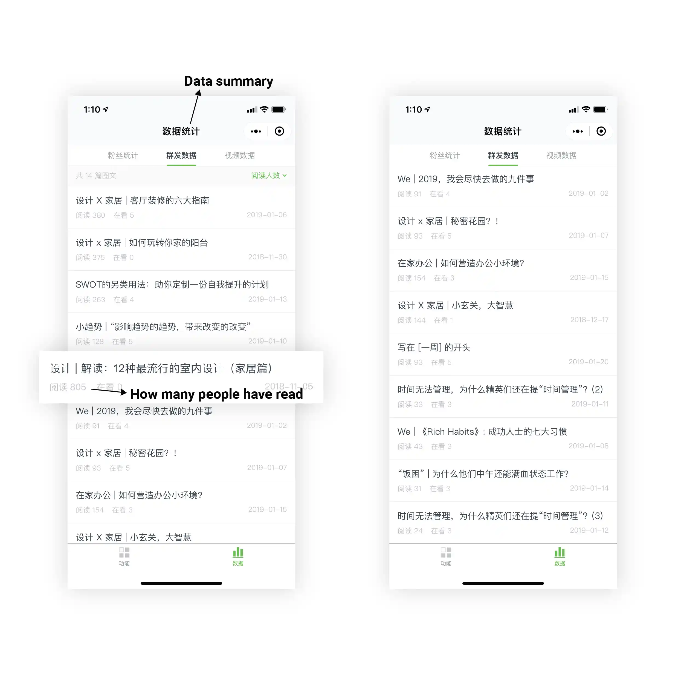
**List of articles and performance**

## Conclusion

The last article was published on Jan. 19 2019. It is a hard decision for me to stop updating my blog. There is plenty of content I wrote that hasn't been published yet. And I received messages from my followers about why not keep updating.

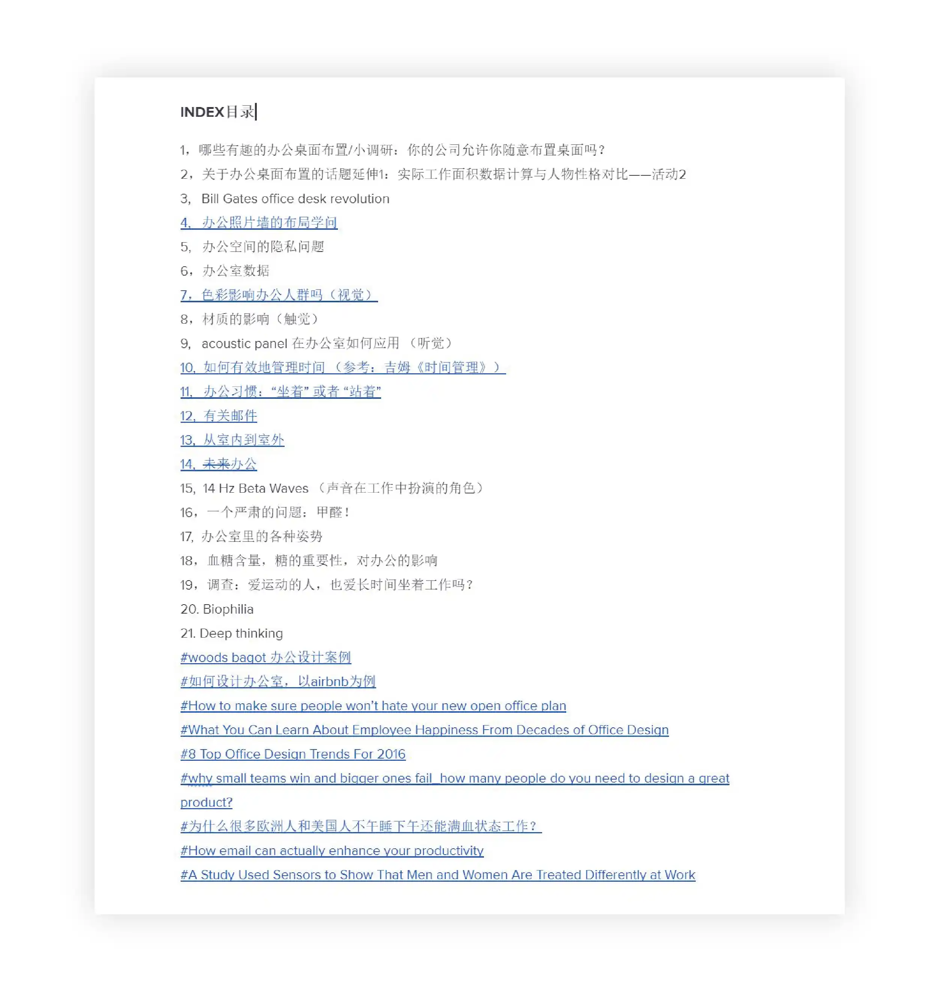
**List of articles waiting for publish**

I understand there shouldn’t be any excuse for stopping doing things. Still, I listed the lessons I learned from this experience.

- Lack of the whole picture, marketing plan from the beginning.
- Tracking and understanding its performing metrics.
- Getting feedback is not only helping you to improve current work; but also motivating you to move forward.
- Feelings should be avoided: feel burnout during the working process. And feel more released instead of excited after publishing an article.

LunchBreak was tickling in my head from time to time. I still spent time occasionally figuring out what it is about, how I could manage my work-life balance to get things done without feeling fatigued. Also, I didn’t regard it as "a failure" or "it has come to an end". Writing this post might be a part of LunchBreak's story and I know it will come back.
