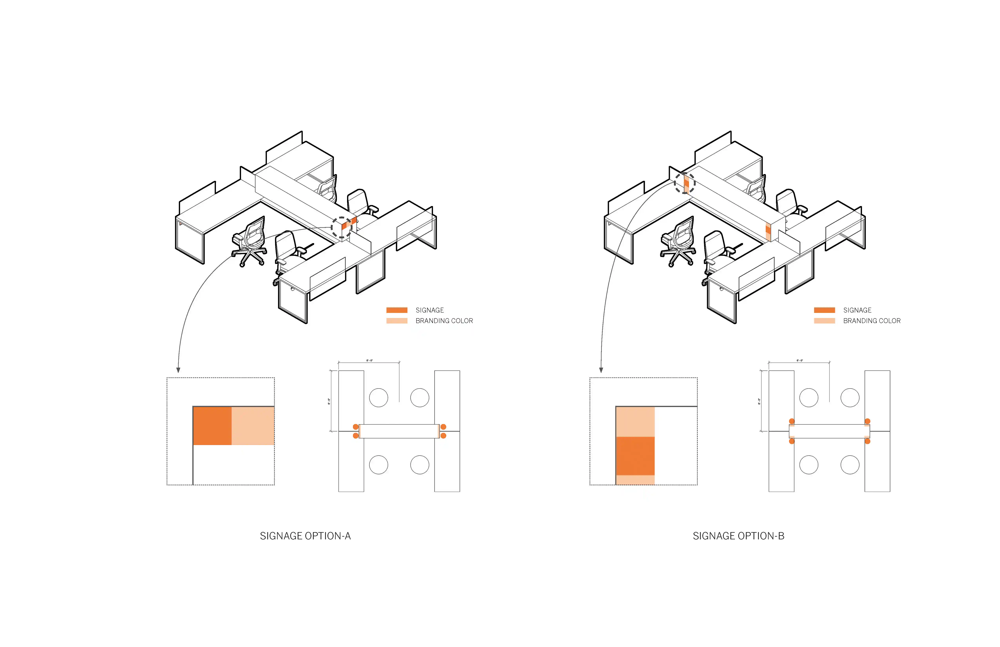
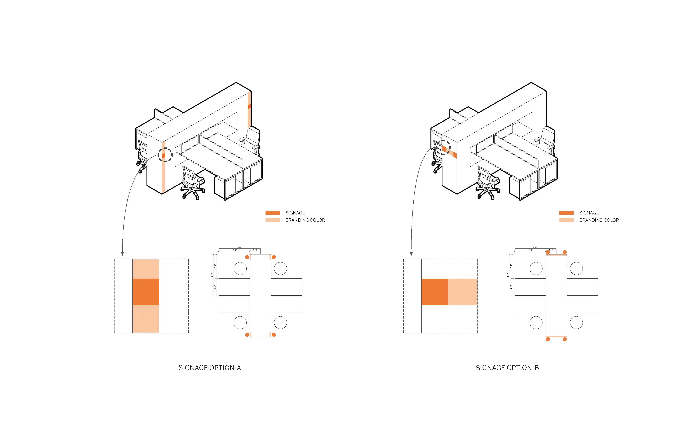
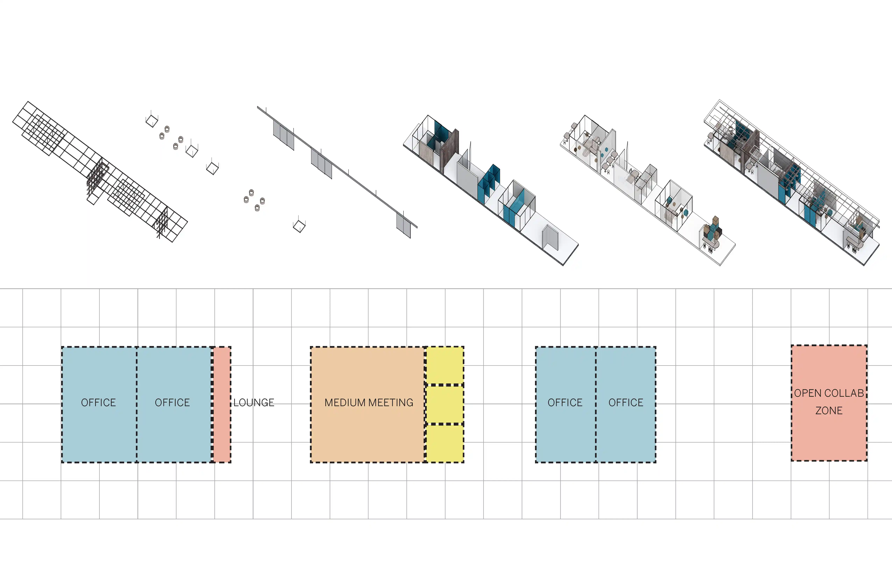
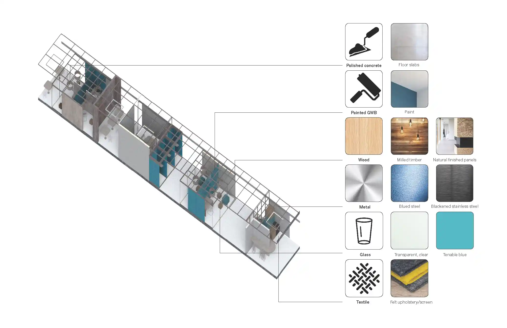
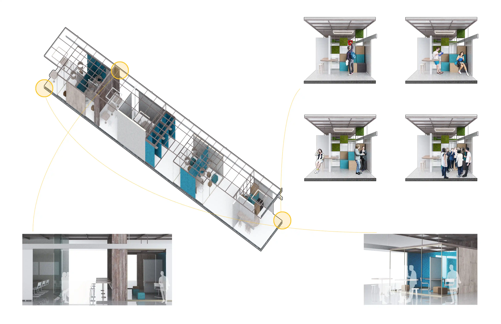

= yaml =
category: 'architecture'
title: 'Anti-office'
slug: 'anti-office'
date: '2018'
duration: '5 min read'
keywords: ['interior', 'office', 'material']
excerpt: 'After visiting the site and several rounds of meetings, the team developed a whole-new design system, called "Anti-office", which consists of Building Scheme, Architectural Bars, and Architectural Elements.'
isFeatured: false
imageSrc: '../../documents/post/image/anti-office/cover.webp'
readMoreUrl: 'posts/anti-office'
= yaml =

_After visiting the site and several rounds of meetings, the team developed a whole-new design system, called "Anti-office", which consists of Building Scheme, Architectural Bars, and Architectural Elements._

**UPDATE 01/02/2022:** Review original post and make some narrating and formatting changes.

## Workstation

### 1. Comparison

**Workstation comparison**

### 2. Options

**Workstation option 1**

**Workstation option 2**

**Workstation option 3**

**Workstation option 4**

## Architectural bar

### 1. Program

**Arch bar program**

### 2. Material

**Arch bar diagram**

### 3. Render

**Arch bar render**
