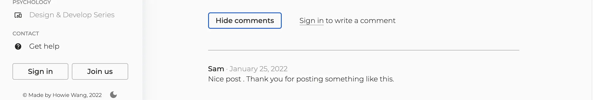

**UPDATE 02/08/2022:** Write about what inspired me to build Lunch Break, what is the process and what I learned.

## Background

The idea of creating LunchBreak starts with my observation while working as an architectural designer. I realize bring aesthetics into people's life is only a part of designer's responsibilities. Convey design ideas and why we implement that way are issues needs designers' attention as well. [Read the full story.](https://www.howiework.com/posts/lunch-break)

## Ideation

### What is the goal

Help people to grow a positive mindset and live a better life by sharing design and psychology knowledge.

### What we believe

**Share** share the latest findings, new design trends and interesting storied in tech.

**Impact** we believe in impact, even if it's just changing your perspective of looking at a problem.

**Diversity** there has never been an era like today, and we have to process tremendous information and countless tasks. Diverse ways of thinking is crucial to reduce pressure in daily life.

## App Features

**Popular posts** - Read the trending and popular contents in tech field.

**Key feature: popular posts**

**Search** - Read the trending and popular contents in tech field.

**Key feature: search**

**Newsletter** - Join our community by subscribing to our weekly newsletter.

**Key feature: newsletter**

**Member exclusive** - Create your own profile and get access to member exclusive features.

**Key feature: member exclusive**

## Roadmap

- Frontend

  - Ideation
  - Design: sketching and design system
  - Set up main pages and layout

- Backend

  - Work with Markdown files
  - Setup MongoDB
  - Work on API route
  - Work on various features

- Optimization

- Deployment

For detailed roadmap (\*step-by-step), please refer to [GitHub](https://github.com/HowieWork/lunch-break#roadmap).

### Built with

![Next][next-shield]
![React][react-shield]
![Mongodb][mongodb-shield]
![Vercel][vercel-shield]
**Main technologies**

## Reflections

Looking back the whole progress, here are some key takeaways:

- Start from simple. Make the application functional first.
- Review code often. Find ways to simplify your codes.
- Testing. Test your code early to make sure the code works correctly.
- Share with others. I shared this app with my friends during the development phase. Got some feedback like the design and navigation.
- Project-based learning motivates me to move forward with a clear picture in mind.

[next-shield]: https://img.shields.io/static/v1?label=Next&message=v10.0.6&color=lightgrey&style=flat-square
[next-url]: https://nextjs.org/
[react-shield]: https://img.shields.io/static/v1?label=React&message=v17.0.1&color=blue&style=flat-square
[react-url]: https://reactjs.org/
[mongodb-shield]: https://img.shields.io/static/v1?label=MongoDB&message=v4.3.0&color=brightgreen&style=flat-square
[mongodb-url]: https://www.mongodb.com/
[vercel-shield]: https://img.shields.io/static/v1?label=Vercel&message=v23.1.1&color=lightgrey&style=flat-square
