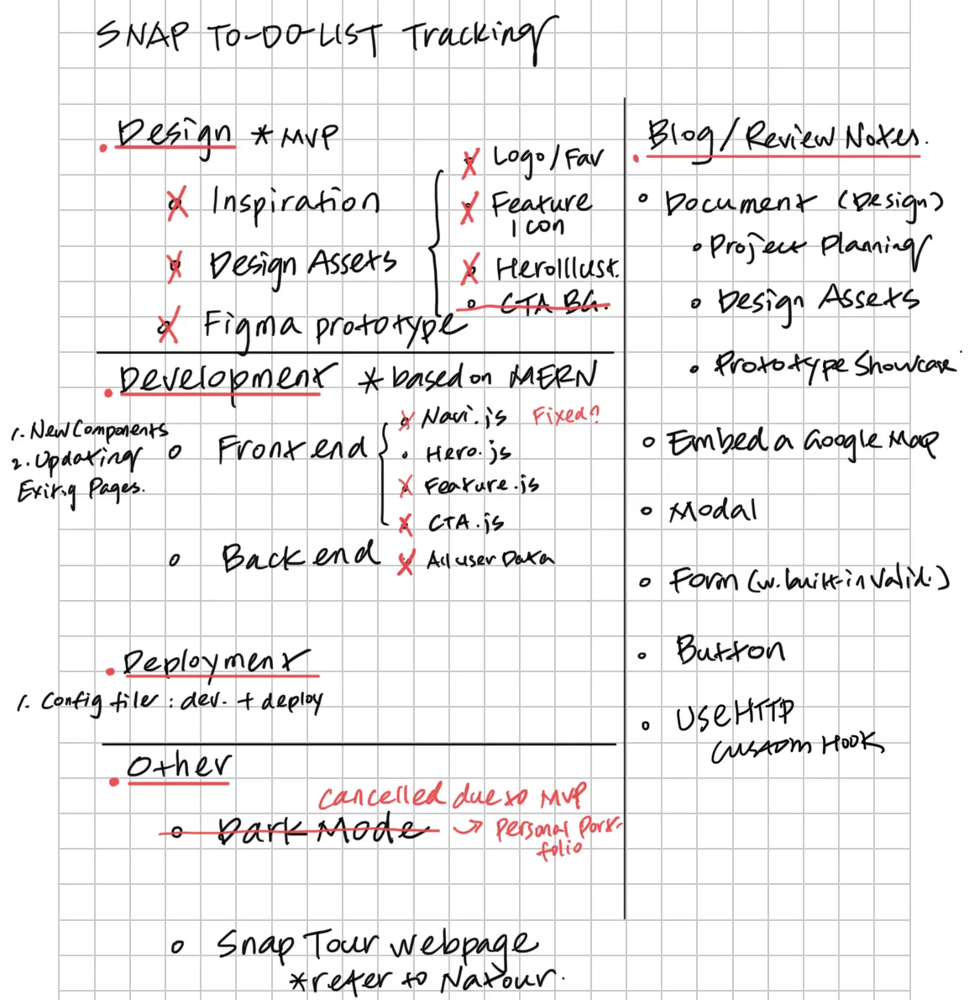
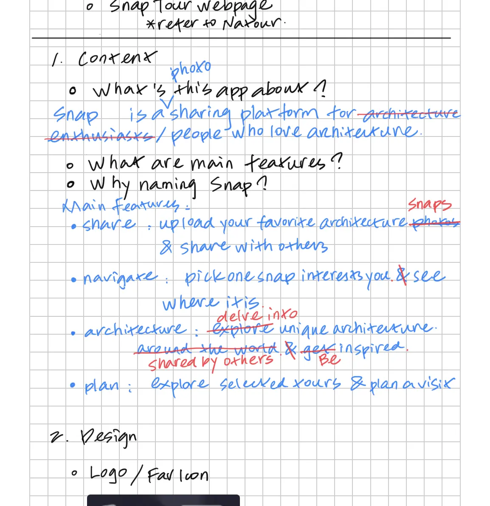
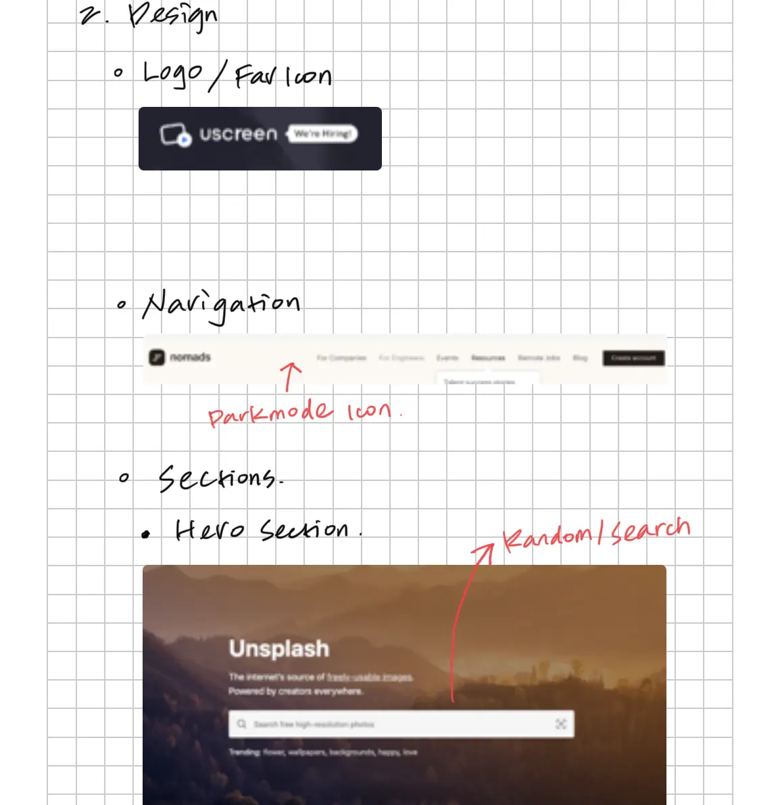
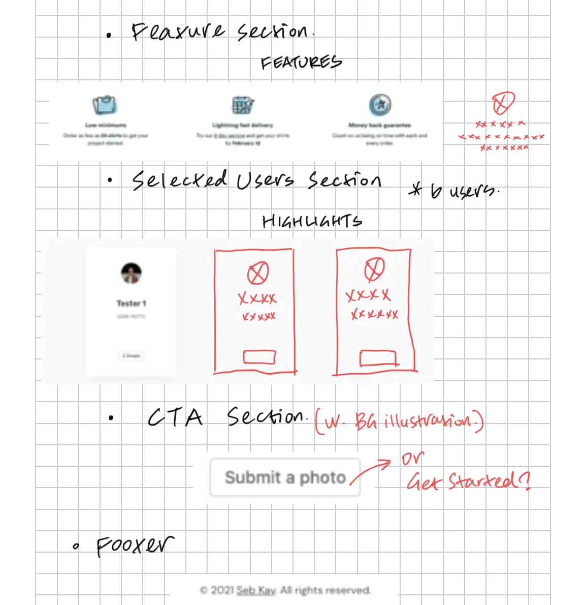
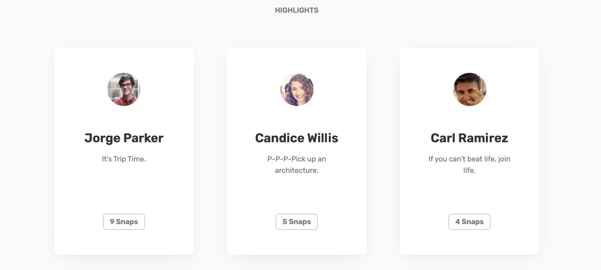
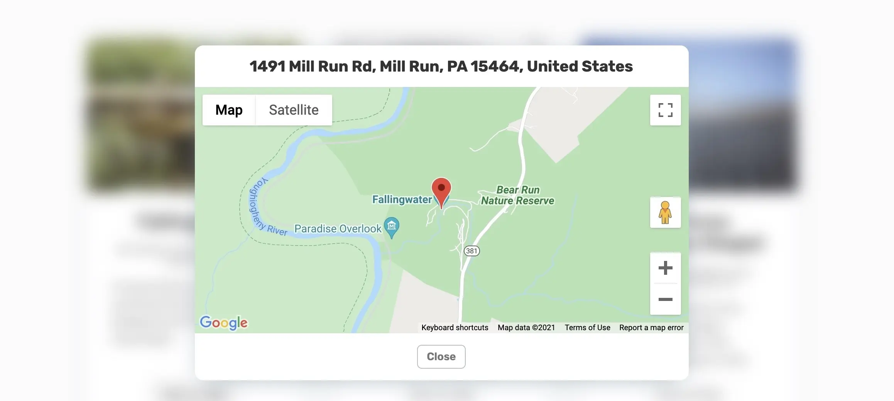
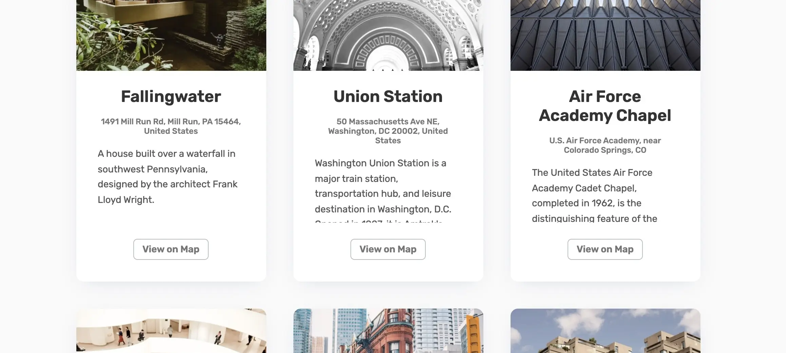
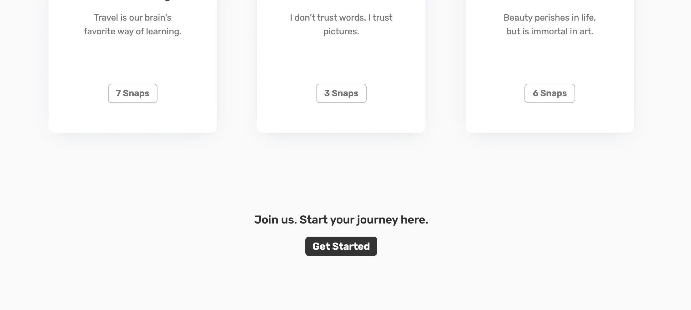

**UPDATE 02/08/2022:** Write about what inspired me to build Snap App, what is the process and what I learned.

## Background

"I believe I saw this building somewhere before.. but I couldn't think of where it is", "I want my project look like that building... hmm... let me think..." While working as an architectural designer, I have met so many clients complain about they couldn't think of certain architecture during early design meetings. They only kept an absurd image of the inspiring architecture in their own mind. It always ended up with wild guess then further research. But those frustration has left a deep impression on me. Wish there could be a solution for this problem.

While self-teaching programming, project-based learning and build tools to solve practical problems always motivate me to move forward. After learning React.js, I believe I found the right tool to solve this problem.

## Ideation & Process

Snap App not only solves the problem but goes beyond that. It focuses on creating a photo sharing platform people who love architecture. SNAP stands for sharing, navigation, architecture and planning.

Following the guidance of MVP, I quickly wrote down notes including design, development, deployment phases:

**Notes examples**

Design also follows the goal of being simple and functional. I chose black and white as color theme and sketched basic layout with a collage of inspirations.

**Design sketch examples**

### App Features

Snap App integrates sharing, navigation, architecture information and tour planning together. Snap aims to create a community and encourage audience get inspired and live a better life. An overview of key features based on final products:

**Share** - Upload a snap and share with others.

**Key feature: share**

**Navigate** - Pick one snap interests you. See where it is.

**Key feature: navigate**

**Architecture** - Delve into unique architecture around the world. Be inspired.

**Key feature: share**

**Plan** - Explore selected tons of tours. Plan a visit.

**Key feature: plan**

## Roadmap

- Frontend

  - Ideation: wireframing, design system
  - Build Structure & React Components

- Backend

  - Build a REST API
  - Create Database
  - Connect React to Backend

- Deployment
  - Deploy REST API \*Heroku
  - Deploy React SPA \*GitHub page

For detailed roadmap (\*step-by-step), please refer to [GitHub](https://github.com/HowieWork/snap-app#roadmap).

### Built with

![React][react-shield]
![Node][node-shield]
![Express][express-shield]
![Mongoose][mongoose-shield]
**Main technologies**

## Reflections

Looking back the whole progress, here are some key takeaways:

- Always keep tracking your progress. Plan ahead. The actual process may take more time than you thought.
- Simple, functional, then beautiful. Make a product functional first. Then work on the rest.
- Learn to divide a big task into small bitable chunks. Tackle each chunk afterwards.
- Get involved in dev community actively. I had many question while building this app. One React discord channel helped me a lot. You are not alone. Most of your problems could have happened on someone else.
- Take breaks. Get out of the bubbles \*what you have been focusing. Then review what you have done and criticize or reflect what can be improved.
- Project inspired by daily life motivates me to move forward. Feel much more rewarding after completion.

[react-shield]: https://img.shields.io/static/v1?label=React&message=v17.0.2&color=blue&style=flat-square
[react-url]: https://reactjs.org/
[node-shield]: https://img.shields.io/static/v1?label=Node&message=v14.17.4&color=green&style=flat-square
[node-url]: https://nodejs.org/
[express-shield]: https://img.shields.io/static/v1?label=Express&message=v4.17.1&color=lightgrey&style=flat-square
[express-url]: https://expressjs.com/
[axios-shield]: https://img.shields.io/static/v1?label=Axios&message=v0.24.0&color=purple&style=flat-square
[axios-url]: https://axios-http.com/
[mongoose-shield]: https://img.shields.io/static/v1?label=Mongoose&message=v6.0.14&color=brightgreen&style=flat-square
[mongoose-url]: https://mongoosejs.com/
